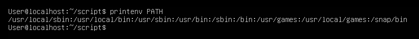
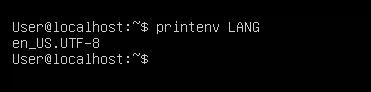
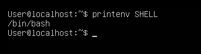
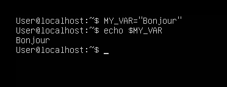
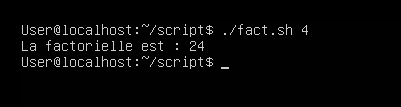

**TP2**

**Exercice 1 : Variables d’environnement**

1. **Dans quels dossiers bash trouve-t-il les commandes tapées par l’utilisateur**

En tapant la commande printenv PATH, on peut voir les dossiers bash où se trouvent les commandes tapées par l'utilisateur.

2. **Quelle variable d’environnement permet à la commande cd tapée sans argument de vous ramener dans votre répertoire personnel ?**

3. **Explicitez le rôle des variables LANG, PWD, OLDPWD, SHELL.**

La variable LANG détermine la langue que les logiciels utilisent pour communiquer avec l’utilisateur.

La variable PWD contient le chemin absolu vers le répertoire courant, elle permet de savoir où on est dans l'arborescence. 

La variable OLDPWD contient le chemin absolu vers le répertoire courant précédent, elle permet de savoir d'où on vient.

La variable SHELL contient l’interpréteur de commande utilisateur. 

4. **Créez une variable locale MY\_VAR (le contenu n’a pas d’importance). Vérifiez que la variable existe.**

5. **Tapez ensuite la commande bash. Que fait-elle ? La variable MY\_VAR existe-t-elle ? Expliquez. A la fin de cette question, tapez la commande exit pour revenir dans votre session initiale.**

La commande bash lance un nouvel interpréteur de commande, la variable MY\_VAR n’existe plus, car c’est une variable locale. Donc en tapant exit on donne accès à la variable MY\_VAR. 

6. **Transformez MY\_VAR en une variable d’environnement et recommencez la question précédente. Expliquez.**

Si on transforme MY\_VAR en une variable d’environnement, en tapant la commande bash la variable MY\_VAR existe, car elle est devenu une variable d’environnement 

7. **Créer la variable d’environnement NOM ayant pour contenu vos prénom et nom séparés par un espace. Afficher la valeur de NOM pour vérifier que l’affectation est correcte.**

8. **Ecrivez une commande qui affiche ”Bonjour à vous, prenom nom !” en utilisant la variable NOM.**

9. **Quelle différence y a-t-il entre donner une valeur vide à une variable d’environnement et l’utilisation de la commande unset ?**

Donner une valeur vide à une variable d’environnement laisse le contenu de la variable vide mais la commande unset supprime la variable d’environnement.

10. **Utilisez la commande echo pour écrire exactement la phrase : $HOME = chemin (où chemin est votre dossier personnel d’après bash)**

**Programmation Bash** 

Vous enregistrerez vos scripts dans un dossier script que vous créerez dans votre répertoire personnel. Tous les scripts sont bien entendu à tester. Ajoutez le chemin vers script à votre PATH de manière permanente.

**Exercice 2 : Contrôle de mot de passe**

Écrivez un script **testpwd.sh** qui demande de saisir un mot de passe et vérifie s’il correspond ou non au contenu d’une variable **PASSWORD** dont le contenu est codé en dur dans le script. Le mot de passe saisi par l’utilisateur ne doit pas s’afficher.

'''bash
#!/bin/bash 

PASSWORD="111" 

read -p 'Ecrivez votre mot de passe ' -s motDePasse

if [ "$PASSWORD" == "$motDePasse" ]; then
    echo "Réussi"
else 
    echo "Echec"
fi
'''

**Exercice 3 : Expressions rationnelles**

Ecrivez un script qui prend un paramètre et utilise la fonction suivante pour vérifier que ce paramètre est un nombre réel

'''bash
    #!/bin/bash

    function is_number() 
    {
        re='^[+-]?[0-9]+([.][0-9]+)?$'
        
        if ! [[ $1 =~ $re ]]; then
        
            return 1 
        else 
            return 0 
        fi 
    }

    read -p "Ecrivez un nombre  " nombre 
    is_number $nombre 

    if [ $? -eq 0 ]; then 
        echo "c'est un nombre"
    else
        echo "Erreur"
    fi
'''

**Exercice 4 : Contrôle d’utilisateur**

Écrivez un script qui vérifie l’existence d’un utilisateur dont le nom est donné en paramètre du script. Si le script est appelé sans nom d’utilisateur, il affiche le message : ”Utilisation : ***nom\_du\_script nom\_utilisateur***”, où ***nom\_du\_script*** est le nom de votre script récupéré automatiquement (si vous changez le nom de votre script, le message doit changer automatiquement)

'''bash
#!/bin/bash

if [ -z $1 ]; then
    echo "Utilisation : $0 nom_utilisateur"
 else
    for utilisateur in $(cut -d: -f1 /etc/passud) 
    do 
        if [ $utilisateur = $1 ]; then 
            echo "Cet utilisateur existe" 
            exit
        fi
    done 
    echo "Cet utilisateur n'existe pas"
fi
'''

**Exercice 5 : Factorielle**

Écrivez un programme qui calcule la factorielle d’un entier naturel passé en paramètre (on supposera que l’utilisateur saisit toujours un entier naturel).

Exemple 1)

'''bash
#!/bin/bash

nbr=$1
while [ $nbr -gt 1 ]
do
    fact=$(($fact*nbr))
    nbr=$((nbr-1))
done

echo La factorielle est : $fact
'''

Exemple 2)

'''bash
#!/bin/bash

fact=1

nbr=$1
i=1
for((i;i<=nbr;i++))
do
    fact=*(($fact*$i))
done

echo La factorielle de $nbr est : $fact
'''

**Exercice 6 : Le juste prix**

Écrivez un script qui génère un nombre aléatoire entre 1 et 1000 et demande à l’utilisateur de le deviner. Le programme écrira ”C’est plus !”, ”C’est moins !” ou ”Gagné !” selon les cas (vous utiliserez $RANDOM).

'''bash
#!/bin/bash

nombre=0
nbrAlea=$((1 + $RANDOM % 1000))

while [ $nombre -ne $nbrAlea ]
do
    echo -n "Entrez un nombre entre 1 et 1000"
    read nombre

    if [ "$nombre" -lt $nbrAlea ]; then
        echo "C'est plus"
    elif [ "$nombre -gt $nbrAlea" ]; then
        echo "C'est moins"
    fi
done

echo "Gagné"
'''

**Exercice 7 : Statistique**

1) Écrivez un script qui prend en paramètres trois entiers (entre -100 et +100) et affiche le min, le max et la moyenne. Vous pouvez réutiliser la fonction de l’exercice 3 pour vous assurer que les paramètres sont bien des entiers.
1) Généralisez le programme à un nombre quelconque de paramètres (pensez à SHIFT)
1) Modifiez votre programme pour que les notes ne soient plus données en paramètres, mais saisies et stockées au fur et à mesure dans un tableau.

'''bash
#!/bin/bash

function is_number() 
{
    re='^[+-]?[0-9]+([.][0-9]+)?$'
    
    if ! [[ $1 =~ $re ]]; then
    
        return 1 
    else 
        return 0 
    fi 
}

min=$1
max=$1
somme=0

while (("$#"))
do
    is_number $1
    if [ $? -eq 0 ]; then
        if [ $1 -lt -100 ] || [ $1 -gt 100 ]; then
            echo "Un des paramètres doit être entre -100 et 100"
        else
            if [ $1 -gt $max ]; then
                max=$1
            elif [ $1 -lt $min ]; then
                min=$1
            fi
        fi
    else
        echo "Erreur, un des paramètres n'est pas un nombre"
    fi

((i++))
somme=$(( somme + $1 ))

shift
done

moyenne=$(echo "$(( $somme / $i ))" | bc -l)

echo "Min : $min"
echo "Max : $max"
printf 'Moyenne : %.2f\n' $moyenne
'''

